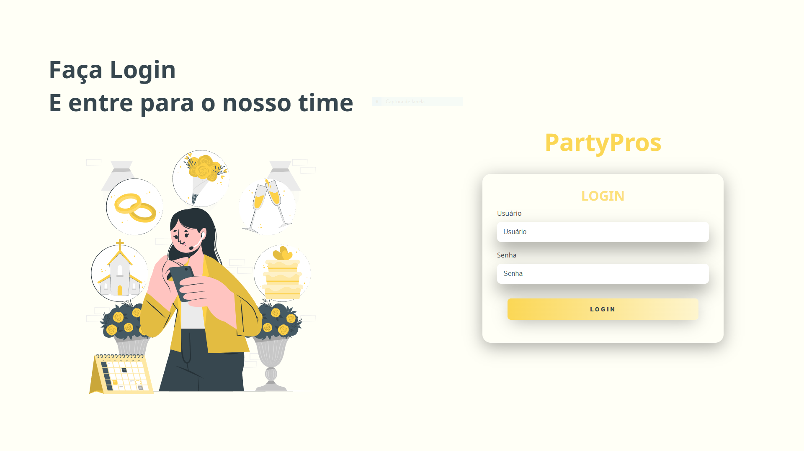
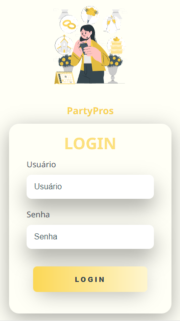

<h1 align="center"> Login Responsivo </h1>

Uma tela de login responsiva de um site de festas junto de uma imagem animada.
  

  <a href="#-tecnologias">Tecnologias</a>&nbsp;&nbsp;&nbsp;|&nbsp;&nbsp;&nbsp;
  <a href="#-projeto">Projeto</a>&nbsp;&nbsp;&nbsp;|&nbsp;&nbsp;&nbsp;
  <a href="#-layout">Layout</a>&nbsp;&nbsp;&nbsp;|&nbsp;&nbsp;&nbsp;
  <a href="#memo-licença">Licença</a>

---

 

## 🚀 Tecnologias

Esse projeto foi desenvolvido com as seguintes tecnologias:

- HTML e CSS
- Git e Github

## 🚩 Preview 

<h3 align="center"> Layout Web 💻 </h3>

 

  

##

<h3 align="center"> Layout Mobile 📱 </h3>

 

  

## 📁 Projeto

- [Acesse o projeto finalizado, online](https://nkdwon.github.io/LoginResponsivo/)

## :memo: Licença

Esse projeto está sob a licença MIT.

---